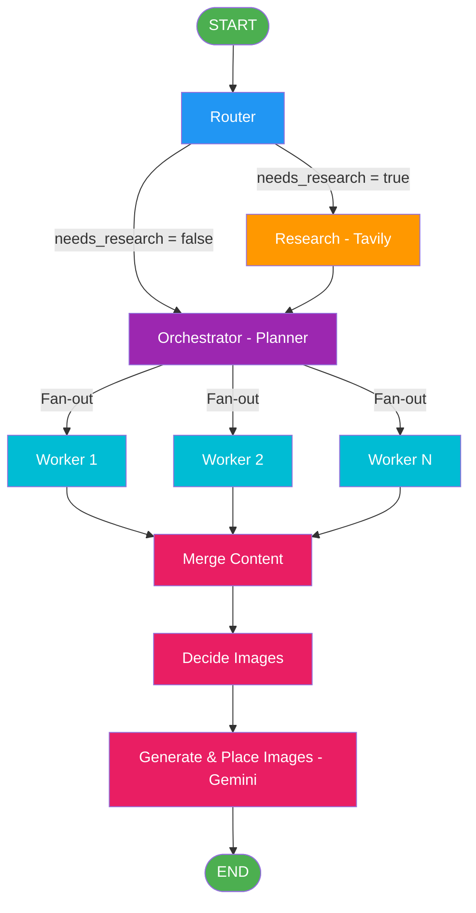

# Blog Writing Agent

An AI-powered blog writing agent built with **LangGraph**, **LangChain**, and **Streamlit**. Given a topic, it autonomously researches, plans, writes, and illustrates a full technical blog post — complete with AI-generated images.

## Frontend


## Architecture & Workflow

The agent follows a multi-stage pipeline orchestrated as a LangGraph state machine:



### Pipeline Stages

| Stage | Node | Description |
|-------|------|-------------|
| 1 | **Router** | Classifies the topic as `closed_book`, `hybrid`, or `open_book` and decides if web research is needed |
| 2 | **Research** | Runs Tavily web searches on generated queries, synthesizes and deduplicates evidence with recency filtering |
| 3 | **Orchestrator** | Creates a structured blog plan (5-9 sections) with goals, bullets, word targets, and metadata per section |
| 4 | **Workers** | Fan-out: each section is written in parallel by an independent worker with full context and evidence |
| 5 | **Reducer** | Three-step subgraph — merges sections, decides image placements (max 3), generates images via Gemini |

## Features

- **Smart Routing** — Automatically determines if a topic needs live web research or can be written from knowledge alone
- **Web Research** — Tavily-powered search with recency-aware filtering (7 days for news, 45 days for hybrid)
- **Parallel Writing** — Sections are written concurrently via LangGraph's fan-out/fan-in pattern
- **AI Image Generation** — Gemini generates technical diagrams and places them contextually in the blog
- **Structured Planning** — Pydantic schemas enforce plan quality (goals, bullets, word targets, tags)
- **Multiple Blog Kinds** — Supports explainers, tutorials, news roundups, comparisons, and system design posts
- **Streamlit UI** — Interactive frontend with tabs for Plan, Evidence, Markdown Preview, Images, and Logs
- **Download & Export** — Download the final blog as Markdown or as a bundled ZIP with images

## Project Structure

```
Blog-Writing-Agent/
├── bwa_backend.py                    # LangGraph pipeline (router → research → orchestrator → workers → reducer)
├── bwa_frontend.py                   # Streamlit UI with live progress, tabs, and past blog loading
├── 1_bwa_basic.ipynb                 # v1: Basic orchestrator → worker → reducer
├── 2_bwa_improved_prompting.ipynb    # v2: Improved prompts with structured schemas
├── 3_bwa_research.ipynb              # v3: Added router + Tavily research
├── 4_bwa_research_fine_tuned.ipynb   # v4: Recency filtering, open_book/hybrid modes
├── 5_bwa_image.ipynb                 # v5: Image planning & generation with Gemini
├── tavily_test.ipynb                 # Tavily API testing notebook
└── assets/
    └── frontend.png                  # Frontend screenshot (add your own)
```

## Iterative Development

The project was built incrementally across 5 notebook iterations:

| Version | Notebook | What Changed |
|---------|----------|-------------|
| v1 | `1_bwa_basic.ipynb` | Minimal orchestrator → parallel workers → reducer pipeline |
| v2 | `2_bwa_improved_prompting.ipynb` | Rich Pydantic schemas, detailed system prompts, section types |
| v3 | `3_bwa_research.ipynb` | Router node for research decisions, Tavily web search, evidence-grounded writing |
| v4 | `4_bwa_research_fine_tuned.ipynb` | Recency-aware filtering, `as_of` date, open_book/hybrid/closed_book modes |
| v5 | `5_bwa_image.ipynb` | Image planning subgraph, Gemini image generation, placeholder-based insertion |

The final `bwa_backend.py` and `bwa_frontend.py` combine all iterations into a production-ready app.

## Tech Stack

- **LangGraph** — State machine orchestration with fan-out/fan-in parallelism
- **LangChain + OpenAI** — LLM calls (GPT-4.1-mini) with structured output via Pydantic
- **Tavily** — Web search API for real-time research
- **Google Gemini** — AI image generation for technical diagrams
- **Streamlit** — Interactive web frontend
- **Pydantic** — Schema validation for plans, tasks, evidence, and image specs

## Setup

### Prerequisites

- Python 3.10+
- API keys for: OpenAI, Tavily (optional), Google Gemini (optional)

### Installation

```bash
pip install langgraph langchain langchain-openai langchain-community streamlit pandas pydantic python-dotenv google-genai tavily-python
```

### Environment Variables

Create a `.env` file in the project root:

```env
OPENAI_API_KEY=your_openai_key
TAVILY_API_KEY=your_tavily_key        # optional, enables web research
GOOGLE_API_KEY=your_google_api_key    # optional, enables image generation
```

### Run

```bash
streamlit run bwa_frontend.py
```

## Usage

1. Enter a blog topic in the sidebar (e.g., "Self Attention in Transformer Architecture")
2. Set the as-of date (relevant for news/time-sensitive topics)
3. Click **Generate Blog**
4. Watch the pipeline progress through Router → Research → Orchestrator → Workers → Reducer
5. Explore results across the **Plan**, **Evidence**, **Markdown Preview**, **Images**, and **Logs** tabs
6. Download the final blog as Markdown or a bundled ZIP

## License

This project is for educational and practice purposes.
